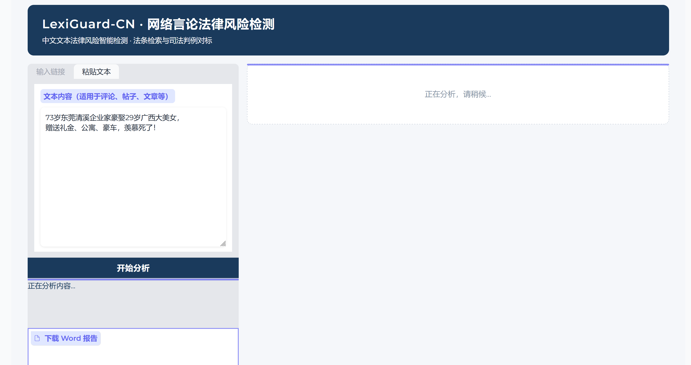
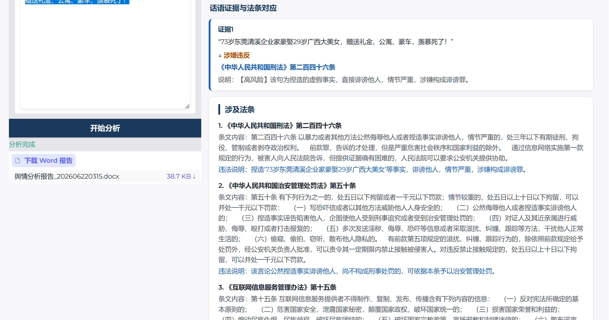
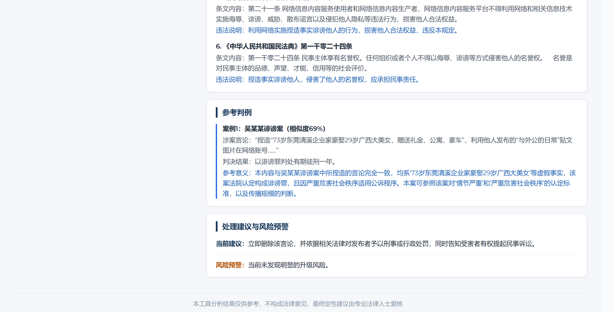
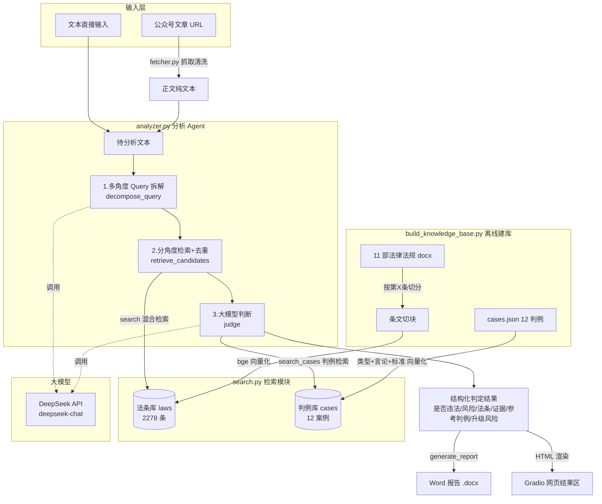

<div align="center">

# LexiGuard-CN

### 🔍 中文网络暴力言论法律风险检测工具


> 基于 RAG 架构，检索 2278 条中国法律条文 +
> 对标最高人民法院 12 个真实判例，
> 自动分析网络言论的法律风险并生成规范报告。

</div>

---

## 📸 演示

**① 输入界面** — 粘贴文本或公众号链接，一键开始分析



**② 分析结果** — 话语证据逐句对应法条，列出全部涉及条款



**③ 参考判例与风险预警** — 对标最高法判例，提示责任升级条件



---

## ✨ 功能特性

| 功能 | 说明 |
|------|------|
| 🔍 法条检索 | 11 部法律法规，2278 条条文，BGE 中文向量模型 |
| ⚖️ 司法对标 | 引用最高人民法院 12 个真实判例 |
| 📝 话语证据 | 逐句提取涉嫌违规言论，对应具体法条 |
| 📊 风险分级 | 高 / 中 / 低 / 无 风险四级判定 |
| ⚠️ 升级预警 | 提示潜在刑事 / 治安责任升级条件 |
| 📄 报告生成 | 一键导出宋体格式 Word 分析报告 |
| 🔗 URL 抓取 | 支持直接输入公众号文章链接 |
| 🌐 网页界面 | Gradio 实现，支持本地和云端部署 |

---

## 🏗️ 系统架构



### 技术栈

| 模块 | 技术选型 | 说明 |
|------|---------|------|
| 向量化 | BAAI/bge-small-zh-v1.5 | 中文专用检索模型 |
| 向量库 | ChromaDB | 本地持久化存储 |
| 关键词检索 | BM25 + jieba | 精确关键词匹配 |
| 融合排序 | RRF | 向量 + 关键词双路融合 |
| 大模型 | DeepSeek API | OpenAI 兼容格式 |
| 框架 | LangChain | Agent 编排 |
| 界面 | Gradio | 网页 UI |
| 报告 | python-docx | Word 文档生成 |

---

## 🚀 快速开始

### 环境要求
- Python 3.10+
- 4GB+ 内存（无需 GPU）
- DeepSeek API Key

### 安装步骤

```bash
# 1. 克隆仓库
git clone https://github.com/MgAlNa3PO4/LexiGuard-CN.git
cd LexiGuard-CN

# 2. 安装依赖
pip install -r requirements.txt

# 3. 设置 API Key
export DEEPSEEK_API_KEY="your_key_here"
# Windows 用户：
set DEEPSEEK_API_KEY=your_key_here

# 4. 构建知识库（首次运行，约 3-5 分钟）
python build_knowledge_base.py

# 5. 启动网页界面
python app.py
# 访问 http://localhost:7860
```

### 服务器部署（无 GPU）

```bash
# 使用 CPU 专用依赖（避免安装 CUDA 相关包）
pip install -r requirements_server.txt
nohup python app.py --server-name 0.0.0.0 --server-port 7860 &
```

---

## 📁 项目结构

```text
LexiGuard-CN/
├── app.py                    # Gradio 网页界面
├── analyzer.py               # 分析 Agent 核心（拆解 / 检索 / 判断 / 报告）
├── search.py                 # 混合检索模块（向量 + BM25 + RRF）
├── fetcher.py                # 公众号文章抓取与清洗
├── build_knowledge_base.py   # 知识库构建（离线运行）
├── main.py                   # 命令行入口
├── eval_cases.py             # 评测脚本（12 判例准确率）
├── requirements.txt          # 本地依赖
├── requirements_server.txt   # 服务器 CPU 版依赖
├── assets/                   # 演示截图
├── law_data/                 # 11 部法律法规原文（.docx）
├── case_data/                # 最高法典型判例（cases.json + .docx）
└── docs/
    └── technical-summary.md  # 项目技术总结文档
```

---

## 📊 评测结果

基于最高人民法院 12 个真实判例评测：

| 指标 | 结果 |
|------|------|
| 总体准确率 | **83.3%** (10/12) |
| 高风险识别 | ✅ 诽谤罪、侮辱罪、侵犯个人信息罪 |
| 灰度案例 | ⚠️ 伪装成舆论监督的侵权言论识别率待提升 |

> **偏差说明**：2 个偏差案例均为“伪装成舆论监督的侵权言论”，
> 系统当前对监督类内容保持审慎，
> 后续计划通过扩充判例库持续优化。

---

## ⚠️ 注意事项

> **免责声明**：本工具分析结果仅供参考，
> 不构成正式法律意见。
> 最终法律定性建议由专业法律人士复核。

- 仅支持中文内容检测
- 知识库基于中国现行法律法规
- 法律条文版本以 `law_data` 目录下文件为准

---

## 🤝 贡献

欢迎提交 Issue 和 PR，特别是：
- 补充更多典型判例
- 优化判断提示词
- 增加新的法律法规

---

## 📄 许可证

MIT License © 2026 Na3PO4
