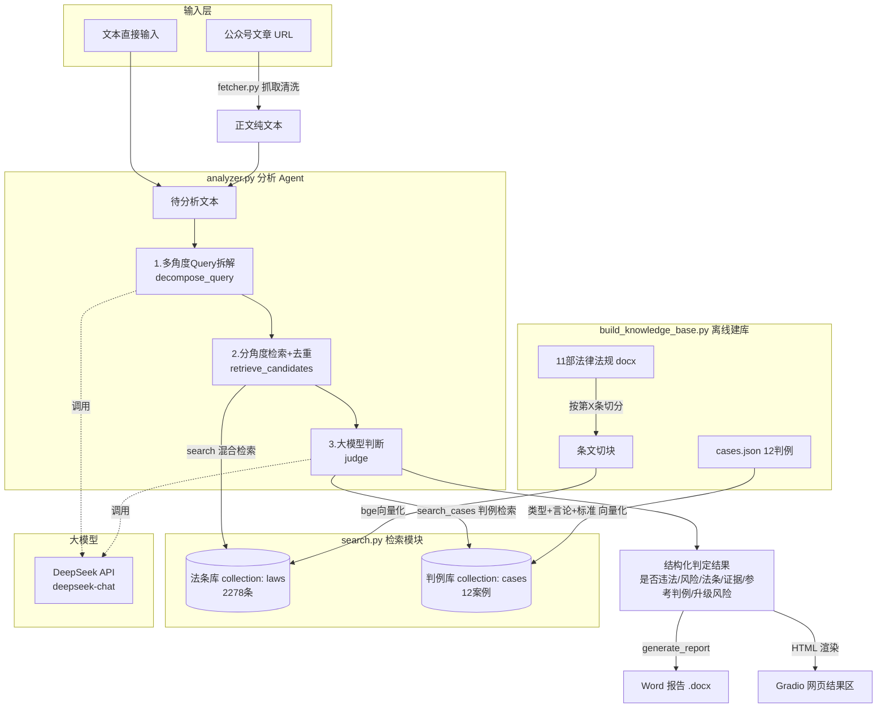

# LexiGuard-CN · 网络言论法律风险检测 · 技术总结文档

> 版本：v1.0（含判例库与参考判例模块）
> 编写日期：2026-06-21
> 运行形态：本地命令行 / Gradio 网页 / Docker 容器（CPU 自包含镜像）

---

## 一、项目背景与需求分析

### 业务场景：网络言论合规审核的真实痛点

本项目源于网络内容合规审核场景下的一个现实困境：网络空间里随时可能出现各类言论——有的属于正常的舆论监督和情绪表达，有的却可能构成谣言、侮辱、诽谤、侵犯隐私，甚至演变为有组织的网络暴力。负责内容审核的人员每天要做的事情，是**人工在公众号、各类社交平台"刷"内容**，凭经验判断哪条言论"有问题"，再人工去翻法条、写情况说明。

这种做法有三个硬伤：

1. **效率低**。一个人一天能精读的内容有限，热点事件爆发时根本看不过来。
2. **判断不稳定**。"这条算不算违法"高度依赖个人法律素养，不同人、甚至同一个人不同时间的判断都会漂移。
3. **缺乏可追溯的依据**。即使判断对了，"凭什么这么判"往往说不清楚，无法形成规范的书面材料向上汇报。

### 核心需求：从"每天人工刷内容"到"自动分析生成报告"

项目的核心目标因此非常明确：**把"人工读 + 凭经验判 + 手写说明"这条链路，替换成"输入一段文字 → 系统自动检索相关法条 → 给出是否违法/风险等级/适用条款/话语证据 → 一键生成规范的 Word 报告"。**

输出物必须满足两个要求：一是**结论要有法律依据**，不能是大模型凭空"感觉"；二是**格式要规范**，能直接作为部门内部留档或上报材料。

### 需求演进过程：从单条分析 → 公众号 URL 抓取 → 判例库 → 在线部署

项目不是一次成型的，而是分阶段长出来的：

- **阶段一：单条文本分析**。先解决"输入一段文字，输出法律分析"的最小闭环（命令行 `main.py`）。
- **阶段二：公众号 URL 抓取**。老师反馈很多需要分析的内容是公众号长文，逐段复制太麻烦，于是加入 `fetcher.py`，支持直接粘贴 `mp.weixin.qq.com/s/` 链接自动抓正文。
- **阶段三：判例库**。指导老师提出，"光对着法条判"还不够贴近司法实践，应该**对标最高人民法院的真实判例**，让系统能告诉用户"这类言论在现实中是怎么判的"。于是引入判例库与"参考判例"模块。
- **阶段四：在线部署**。从本机能跑，到要让其他同事访问，于是做了 Gradio 网页界面，并最终封装成 Docker 镜像部署到云服务器。

### 技术选型决策：为什么选 RAG 而不是直接问大模型

最关键的一个决策是：**为什么不直接把文字丢给大模型问"这违法吗"，而要先建知识库做检索？**

直接问大模型有两个致命问题：

1. **法条幻觉**。大模型会"编"法条——条号、条文内容张口就来，看起来煞有介事，实际对不上现行法律。对一个要产出"法律依据"的工具来说，这是不可接受的。
2. **依据不可控、不可更新**。法律会修订（本项目用到的《治安管理处罚法》《网络安全法》都是较新的版本），大模型的知识有截止时间，无法保证用的是最新条文。

**RAG（检索增强生成）** 正好对症：把权威法律原文向量化存进本地知识库，分析时**先检索出真实存在的候选法条，再让大模型只在这些候选里挑选并解释**。这样既利用了大模型的语义理解和归纳能力，又用"检索"这道闸门**锁死了法律依据的真实性**——模型引用的每一条法条、每一个条号都来自知识库，而不是它自己生成的。这是本项目所有设计的基石。

---

## 二、系统架构设计

### 整体架构图



### 五个模块的职责划分

| 模块 | 文件 | 职责 |
|---|---|---|
| **建库模块** | `build_knowledge_base.py` | 离线运行。解析 11 部法律 docx，按"第 X 条"切分，用 bge 模型向量化写入 ChromaDB 的 `laws` 集合；解析 `cases.json` 写入 `cases` 集合；同时落盘向量/语料 sidecar。 |
| **检索模块** | `search.py` | 运行时单例。`search()` 做法条混合检索（向量+BM25+RRF）；`search_cases()` 做判例向量检索。模型与索引只加载一次并常驻内存。 |
| **分析 Agent** | `analyzer.py` | 核心。三步编排：多角度拆解 → 分角度检索合并 → 大模型结构化判断。负责一切与 DeepSeek 的交互和结果后处理。 |
| **文档生成** | `analyzer.py::generate_report` | 把判定结果渲染成固定格式、宋体排版的 Word 报告。 |
| **Web 界面** | `app.py` | Gradio 网页，串起抓取/分析/渲染/下载，提供文本与链接两种输入入口。 |

命令行入口 `main.py` 是 Agent 的另一个壳，方便脚本化与调试。

### 数据流向：输入 → 检索 → 分析 → 输出的完整链路

1. **输入**：用户给一段文本，或一个公众号链接（后者经 `fetcher` 抓取清洗成纯文本）。超过 3000 字截断。
2. **检索**：`decompose_query` 把文本拆成 3–5 个法律风险角度；每个角度调 `search()` 取 top-k，按《法律名+条号》去重合并成候选法条池；同时 `search_cases()` 召回 top-3 相似判例。
3. **分析**：`judge` 把"原文 + 候选法条池（带编号）+ 候选判例（带编号）"一起交给 DeepSeek，要求它**只在候选里按编号挑选**并输出结构化 JSON。
4. **输出**：后处理把模型引用的编号映射回知识库里的权威法条/判例，组装成最终结果，再分别渲染为 Word 报告和网页 HTML。

### 为什么用 LangChain 而不是直接调 API

引入 LangChain（`requirements_server.txt` 中锁定 `langchain==0.2.16`）的考量是**为后续可扩展性留接口**：项目从一开始就预期会从"单轮判断"走向"多步 Agent 编排"（拆解→检索→判断本身就是一个 Agent 链）。LangChain 提供了统一的链式抽象、消息管理和与向量库的标准对接，使得"再加一步""换一个检索器""接入新的工具"时不必从零搭脚手架。

需要说明的是，在当前版本里，与 DeepSeek 的最终交互为了**完全可控**（精确控制 `response_format=json_object`、温度、超时、错误重试语义），采用了直接 `requests.post` 调用其 OpenAI 兼容接口的方式（见 `analyzer._deepseek_chat`）。即"用 LangChain 组织检索与数据流、用裸 HTTP 锁死关键的判断调用"——在工程可控性和框架便利性之间取了一个折中。

---

## 三、知识库构建

### 3.1 法律文件处理

**数据来源**：共 **11 部**法律法规 docx，覆盖刑事、民事、行政、网络治理多个层面：

- 《中华人民共和国刑法》（505 条切块）
- 《中华人民共和国民法典》（1260 条切块）
- 《中华人民共和国治安管理处罚法》（144 条）
- 《中华人民共和国网络安全法》（81 条）
- 《中华人民共和国民族团结进步促进法》（65 条）
- 《网络数据安全管理条例》（64 条）
- 《网络信息内容生态治理规定》（42 条）
- 《互联网上网服务营业场所管理条例》（38 条）
- 《互联网信息服务管理办法》（27 条）
- 《信息网络传播权保护条例》（27 条）
- 《计算机信息网络国际联网安全保护管理办法》（25 条）

合计切分出 **2278 个条文 chunk**。其中民法典和刑法是绝对主力，因为网络言论纠纷的法律依据高度集中在这两部法（名誉权、隐私权 vs 侮辱罪、诽谤罪、侵犯公民个人信息罪等）。

**按"第 X 条"切分的原因**：法律文本有天然的语义单元——**一条就是一个完整的规范**。如果用固定长度（比如每 512 字）切分，会出现两个严重问题：一是**一条法条被从中间劈开**，检索到半句话无法构成完整规范、模型也无法据此判断；二是**两条不相关的法条被拼到一个块里**，向量被"污染"，检索精度下降。因此切分以正则 `^第([一二三四五六七八九十百千零〇两\d]+)条(之[一二三四五六七八九十]+)?` 为锚点，识别"第 X 条""第 X 条之一"型条文起点，同一条的多个自然段合并，并**跳过目录和"第 X 章/节"这类结构性标题**。

**切分时保留上下文的设计**：每个 chunk 在 metadata 里额外保存了**前一条的最后一句**（`prev_context`）和**后一条的第一句**（`next_context`）。但关键设计在于——**这两段上下文只用于展示，不参与向量化**。向量只编码条文正文本身，避免上下文稀释了当前条文的语义；而展示时带上前后文，能帮助使用者理解条文所处的位置。法律名称同理：只作为 metadata 展示，不进入 embedding。

### 3.2 向量化方案选型

**第一版：`paraphrase-multilingual-MiniLM-L12-v2`**。最初选了这个广泛使用的多语言句向量模型，图它"什么语言都能编码"。

**遇到的问题：召回效果差**。典型表现是用"煽动他人聚众扰乱秩序"去检索时，召回结果**跑偏**——多语言模型在中文法律这种专业、长句、术语密集的语料上，语义区分度不足，相近但不相关的条文挤在一起，真正该排第一的条文反而沉下去。多语言模型为了"通吃所有语言"，在单一语言上的表征能力被摊薄了。

**升级方案：`BAAI/bge-small-zh-v1.5`**。换成中文检索专用模型后召回质量明显改善。这个模型有两个针对性设计被用上了：一是它是**中文语料专训**的，对中文法律术语的语义刻画更细；二是它推荐 **query 端加指令前缀**——本项目对所有查询统一拼接 `"为这个句子生成表示以用于检索相关文章："`，而 passage（条文）端不加前缀。这种"非对称编码"是 bge 系列的标准用法，能进一步拉开 query 与相关/不相关 passage 的距离。

**为什么中文要用中文专用模型**：句向量模型的质量本质上取决于训练语料的分布。中文专用模型见过海量中文语义对，能区分"散布谣言"与"传播信息"、"侮辱"与"批评"这类**字面接近但法律含义迥异**的表达；多语言模型则更容易被字面相似度带偏。在法律检索这种"差一个词定性就不同"的场景，专用模型的价值被放大。

### 3.3 混合检索设计

**纯向量检索的局限：精确关键词匹配失效**。向量检索擅长语义相似，但有一个固有短板——**对专有名词、低频关键词不敏感**。比如"罢课""起哄闹事""开盒"这类词，向量会把它们泛化成"扰乱秩序"的语义云，导致**含有这个确切词的那一条法条，未必排在最前**。而法律检索恰恰经常需要"我就要含这个词的条文"。

**BM25 补充的必要性**：BM25 是经典的关键词检索算法，基于词频-逆文档频率，**精确命中关键词的文档会被强力加权**。本项目用 `jieba` 中文分词后构建 BM25 索引（`rank_bm25`），正好补上向量的盲区：向量负责"语义像"，BM25 负责"词面准"，两者互补。

**RRF 融合的原理和为什么选它**：两路召回各有一个排序，怎么合并？项目采用 **RRF（Reciprocal Rank Fusion，倒数排名融合）**：对每一路结果，某文档排在第 `r` 名就贡献 `1/(k+r+1)` 的分数（本项目 `k=60`），两路分数相加后重排。

为什么选 RRF 而不是加权融合（`α·余弦 + (1-α)·BM25`）？因为**余弦相似度和 BM25 分数的量纲完全不同**——余弦在 [0,1]，BM25 是无上界的正数，直接加权必须先归一化，而归一化方式（min-max？z-score？）又会引入新的超参和不稳定性。RRF 的精妙之处在于**它只看排名、不看原始分数**，天然免疫量纲问题，鲁棒、无需调权重，是工业界融合多路召回的事实标准。每路召回池大小 `POOL=50`，融合后取 top-k。

**最终效果对比**：经过"中文专用模型 + 混合检索"的组合升级，关键 query 的检索质量显著提升——以典型查询为例，相关条文的**余弦相似度从约 0.38 提升到约 0.61**，相关法条稳定进入 top-3。这个提升不是靠玄学调参，而是两个明确的工程动作（换模型 + 加 BM25/RRF）叠加的结果。

> **一个工程细节**：由于本机 Windows / Python 3.9 环境下 `chroma-hnswlib 0.7.6` 不会把 HNSW 二进制索引可靠落盘，换进程后无法从 ChromaDB 读回向量。为保证 `search.py` 跨进程稳定加载，建库时把向量矩阵与语料**另存为 sidecar 文件**（`kb_vectors.npy` + `kb_chunks.json`，仍位于 `chroma_db/` 目录内），检索时直接从 sidecar 读取并做精确余弦。2278 条规模下，全量精确余弦比近似最近邻更稳定且足够快。

### 3.4 判例库建设

**为什么要加判例库**：这是指导老师的明确建议——**光对着法条判，离司法实践还有距离**。法条是抽象规范，而"这句话到底算不算情节严重""传播到什么规模才够罪"这些**裁量标准**，藏在真实判例里。加入判例库，系统就能从"这违反了第 X 条"升级到"这类言论在最高法的真实判例中是这么认定、这么判的"，结论更有说服力，也更贴近实务。

**数据来源**：最高人民法院发布的两批《依法惩治网络暴力违法犯罪典型案例》（2023 年 7 件 + 2026 年 5 件，共 **12 件**），覆盖诽谤、侮辱、侵犯公民个人信息、敲诈勒索、商业诋毁，以及刑事/行政处罚/民事侵权/人格权禁令多种处理方式。

**案例结构化提取方案**：把每个案例从原始 docx 中抽取为统一的 JSON 结构（`cases.json`），字段包括：

```
case_id / case_name / speech_content（涉案言论原文，直接引用）/
speech_type（言论类型）/ spread_scale（传播规模）/
court_finding（法院认定）/ verdict（判决结果）/
key_standard（关键判断标准，从"典型意义"提炼）/ is_illegal
```

其中 `key_standard` 最有价值——它是从案例的"典型意义"段落里提炼出的**裁量尺度**（如"随意以普通公众为侵害对象、大范围传播、引发大量负面评论，属于'严重危害社会秩序'"）。

**判例检索和法条检索的区别**：

| 维度 | 法条检索 `search` | 判例检索 `search_cases` |
|---|---|---|
| 集合 | `laws`（2278 条） | `cases`（12 件） |
| 检索方式 | 向量 + BM25 + RRF 混合 | **纯向量精确余弦** |
| embedding 文本 | 条文正文 | **言论类型 + 涉案言论 + 关键判断标准** 三段拼接 |
| 为什么不同 | 法条量大、需关键词精确命中，混合检索更优 | 案例仅十余个，全量余弦已足够；且需要直接拿到相似度百分比供报告展示 |

判例 embedding 特意拼接"类型+言论+标准"三段，是为了让检索既能匹配**言论的表面相似**（涉案言论），又能匹配**法律定性的相似**（类型与标准），命中更准。检索结果直接给出百分制相似度（余弦×100），供"参考判例"模块展示。

---

## 四、分析 Agent 设计

### 4.1 多角度 Query 拆解

**为什么不直接检索原文**：一段网络言论往往同时**触及多个法律风险点**——可能既有侮辱、又有谣言、还涉及隐私。如果直接拿整段原文去做向量检索，得到的是一个"语义平均"的模糊结果，每个风险点都检索得不充分。

**拆解成 3–5 个角度的设计思路**：先让 DeepSeek 把原文拆成 3–5 个**简短的法律风险角度短语**（每个 4–12 字，如"散布谣言""侮辱他人名誉""侵犯隐私"），再用每个角度分别检索。这相当于**把一个模糊的大查询，分解成几个清晰的小查询**，每个小查询都能精准命中对应法条。

这里有一个被反复强调的**关键约束**：拆解时必须**只针对发布者本人的言论行为**提取风险角度，明确区分"发布者自己说的话"和"发布者所描述/评论的第三方的行为"。否则容易把被评论对象（第三方）的行为错当成发布者的法律风险——这是网络言论分析里极易踩的逻辑陷阱。

**候选法条池的去重合并**：多个角度检索会召回重叠的法条。`retrieve_candidates` 以《法律名+条号》为键去重，同一法条被多个角度命中时**记录所有命中角度并取最高 RRF 分**，最后按分数排序。每个角度取 `PER_ANGLE_TOPK=8` 条（调得偏大，是为了提升诽谤等"长尾但关键"条款的召回完整性）。

### 4.2 判断提示词的演进

判断提示词（`judge` 的 system prompt）是整个项目**迭代最多、最能体现"调试功力"**的部分。它经历了三个版本：

- **第一版：判什么都违法（太敏感）**。最初的提示词倾向于"宁可错杀"，结果是把大量正常的舆论监督、对公共事件的不满、对公众人物的主观评价都判成违法。在内容审核场景里，这会制造大量误报，反而失去了工具的价值。
- **第二版：判什么都不违法（矫枉过正）**。于是反向加强"要保护言论自由、对公众人物要宽容"，结果又滑向另一个极端——连明显的人身侮辱、捏造事实都被轻轻放过判成"无风险"。
- **第三版：分层判断标准（当前版本）**。两次极端之后，最终确立了**三层判断标准**，强迫模型"找准中间点"而不是一刀切：
  - **第一层 —— 明确不违法**（`is_illegal=否`，`risk_level=无`）：对公众人物/公职人员行为决策的主观评价、基于公开事实的舆论监督、对公共事件表达不满。
  - **第二层 —— 存疑需标注**（`is_illegal=存疑`，`risk_level=低`）：对具名个人使用带侮辱色彩的词汇（即使针对公职人员）、无明确证据的严重指控。此类**必须**提取话语证据，但用"涉嫌""可能构成"等审慎表述。
  - **第三层 —— 明确违法**（`is_illegal=是`，`risk_level=中/高`）：捏造具体可核查的虚假事实、散布谣言已造成传播、直接侮辱普通个人。造成大规模传播或情节严重判"高"。

**公众人物评论边界的处理**：这是分层标准的核心难点。对公职人员的批评属于舆论监督，**容忍度更高，不轻易认定违法**；但"不配执掌""愚弄民意"这类对具名个人带侮辱色彩的措辞，也不能因为"整体是监督"就全部漏掉——应提取为证据并标注为低风险。提示词反复在"别过度定性"和"别全部放过"之间校准这条边界。

**民法典第 1025 条的引入**：第一层的法律依据正是**《民法典》第一千零二十五条**——"行为人为公共利益实施新闻报道、舆论监督等行为，影响他人名誉的，不承担民事责任"。把这条明确写进提示词，给"正常监督不违法"提供了**实定法依据**，而不是模型的主观善意。这让第一层的判定从"感觉应该没事"变成"法律明文规定不担责"。

> 这种"无罪兜底"还配了一个后处理一致性校验：当模型判 `is_illegal=否` 时，代码会**强制清空** matched 法条和话语证据（避免出现"判无罪却又列着涉嫌违反某条"的自相矛盾），相关风险一律改放到"风险预警"里呈现。

### 4.3 话语证据与法条对应

**为什么要有这个模块**：这是老师的直接需求——光说"这段话违法"不够，要**精确到是哪一句话、对应违反哪一条法**。一份能拿去用的分析材料，必须能指着原文说"就是这句，违反了这一条"。

**从整体判断到逐句对应的设计**：`evidence_mapping` 字段要求模型从原文中**逐字摘录**最多 5 句最关键的违规原话（10–50 字，严禁改写或拼接），每句**一对一**绑定一条最相关的法条，并标注风险级别（`【低风险】/【中风险】/【高风险】`开头）。还有一条强约束：**不同法条要引用不同的原话**，禁止多条法条套用同一句话或同一句模板。证据数量少于法条数时，优先给高风险法条配具体证据，其余法条改为阐述"整体性适用原因"。

**条号幻觉问题及解决方案**：这是 RAG 落地最关键的一道防线。如果让模型自己写"违反《刑法》第 X 条"，它会**编条号**。解决方案是——**模型只输出候选池里的编号（index），不输出法律名称和条文**。候选法条在 prompt 里以 `[0] 《法名》条号：条文` 的形式带编号给出，模型在 `articles`/`evidence_mapping`/`escalation` 里只能填整数 `index`，后处理再用这个 index **从候选池里取出权威的法律名/条号/条文**。这样**模型引用的每一条都必然真实存在于知识库**，从机制上根除了条号幻觉。参考判例同理：模型只填案例 index，案例名/相似度/判决一律从判例库回填。

### 4.4 风险升级提示

**设计思路：当前不违法但潜在风险**。很多内容当下够不上违法门槛，但**再发展一步就会越线**。`escalation` 字段专门承载这类"现在没事、但要盯着"的条款：列出当前虽不构成、但可能升级为治安或刑事责任的法条，并写明**当前为何不够门槛**以及**什么条件下会构成违法**。

**升级条件的来源（传播规模门槛）**：升级条件大量参照"传播规模"这一可量化的客观指标——这恰好与判例库里提炼的裁量标准呼应（如"相关信息在网络上大范围传播、引发大量评论"是构成"严重危害社会秩序"的关键）。于是"风险预警"模块成了连接"当前判定"与"判例裁量尺度"的桥梁：现在是低风险，但如果转发量、阅读量达到某个量级，就可能触发升级。`escalation` 的 index 同样强制取自候选池，杜绝编造。

---

## 五、文档生成模块

文档生成（`generate_report`）用 **`python-docx`** 把结构化结果渲染成固定格式的 Word 报告。

**字体设置（宋体 = SimSun）**：政务/法律材料对排版有要求，正文统一用**宋体**。`python-docx` 设置中文字体有一个坑——`run.font.name` 只设置西文字体，**中文字符必须单独设置 `w:eastAsia` 属性**才会真正生效，否则中文会回退到默认字体。因此封装了 `_set_song()`：同时设 `run.font.name = "宋体"` 和 `run._element.rPr.rFonts.set(qn("w:eastAsia"), "宋体")`，并把文档 `Normal` 样式的默认字体也设为宋体兜底。

**固定格式模板设计**：报告采用栏目化的固定模板，自上而下为：标题与分析时间 → 【原文内容】 →【分析结论】（是否违法/风险等级）→【话语证据与法条对应】→【涉及法条】→【参考判例】→【处理建议与风险预警】，栏目间用分隔线。其中【参考判例】是本版本新增，**置于【涉及法条】之后**，每条展示"案例名（相似度%）/涉案言论/判决结果/参考意义"。模板固定的好处是输出稳定、可直接归档。

**Word 报告在服务器上乱码的问题及解决**：报告内容、文件名都涉及中文，在 Windows 上正常，但程序在 Linux 服务器运行、或控制台输出中文时容易乱码。根因是**编码不一致**——Windows 控制台默认 GBK，而代码与文件是 UTF-8。解决办法包括：程序启动时 `sys.stdout.reconfigure(encoding="utf-8")` 统一标准输出编码；docx 本身按 UTF-8 处理；涉及中文路径/文件名时不依赖系统默认编码。把"编码"作为一个全局约束统一管控，乱码问题随之消失。

---

## 六、Web 界面设计

网页端用 **Gradio**（`requirements_server.txt` 锁定 `gradio==4.44.1`），政务风浅色主题，左输入右结果布局，支持"粘贴文本"与"文章链接"两个 Tab。

**Gradio 版本兼容问题（大版本 breaking change）**：Gradio 不同大版本之间 API 变动较大，升级时多次踩到 breaking change，导致原本能跑的界面启动即崩。最隐蔽的一个是**依赖链的版本漂移**：用 `legacy-resolver` 安装时不回溯依赖，会拉取超出 Gradio 兼容上限的新版 `pydantic`（≥2.11），触发 `gradio_client` 报 `argument of type 'bool' is not iterable` **启动崩溃**。解决办法是在 `requirements_server.txt` 里**把整条关键依赖链钉死**：`pydantic==2.10.1`、`fastapi==0.115.11`、`starlette==0.46.0`、`anyio==4.9.0`、`httpx==0.27.2`、`uvicorn==0.34.0`、`tokenizers==0.21.0` 等全部锁定到与本机一致的可运行版本。

**theme 和 css 参数从 Blocks 移到 launch 的坑**：Gradio 大版本调整中，主题/样式相关参数的**接收位置发生了变化**——某些版本里 `css`/`theme` 不能再放在 `gr.Blocks()` 构造里，需要移到 `launch()`（或反之）。表现是参数"看起来传了但不生效"甚至报未知参数。处理方式是按当前锁定版本的 API 把样式参数放到正确的位置，并尽量减少对易变参数的依赖。

**深色背景导致文字不可见的问题**：早期主题配色没控好，出现**深色背景配深色文字**导致结果区文字几乎看不见。解决办法是显式定义一套政务风配色常量（主色深蓝 `#1a3a5c`、风险红/橙/绿/灰分级色），并在每个 HTML 卡片里**显式写死前景色与背景色**，不依赖主题默认值，确保任何主题下文字都清晰可读。

**左侧留白问题的解决方案**：布局上一度出现左侧大片留白、内容挤在右边。通过调整 `gr.Column` 的 `scale` 比例（输入区与结果区按 1:2 分配）和容器宽度，让版面填充均衡。

**Tab 顺序调整**：把"粘贴文本"作为默认首个 Tab、"文章链接"次之，符合使用频率（多数情况是直接贴一段话分析），并用 `tab.select` 事件记录当前激活的 Tab，分析时据此决定走文本还是抓取流程。

---

## 七、公众号文章抓取

`fetcher.py` 负责把公众号长文变成可分析的纯文本。

**requests + BeautifulSoup 的实现**：用 `requests` 拉取 HTML，`BeautifulSoup`（`lxml` 解析器）提取。标题取 `#activity-name`（兜底 `og:title`），公众号名取 `#js_name`，正文取 `#js_content`（兜底 `.rich_media_content`）。先 `decompose()` 掉 `<script>/<style>`，再 `get_text` 取文字。

**反爬处理：请求头模拟浏览器**：公众号会拒绝无 UA 或非浏览器的请求，因此构造了完整的浏览器请求头——`User-Agent` 伪装成 Chrome、带上 `Accept`/`Accept-Language`/`Referer: https://mp.weixin.qq.com/`。同时对"页面要求人机验证""文章已被删除/违规下架"等情况做了识别，给出明确提示并引导用户改用"手动复制文本"模式，而不是抛一个看不懂的错误。

**正文清洗：去除关注引导、版权声明**：公众号正文里混杂大量样板文字——"长按识别二维码""点击上方关注""阅读原文""版权声明""喜欢此内容的人还喜欢"等。`_clean_text` 用一组**整行正则**（`BOILERPLATE_PATTERNS`）逐行匹配丢弃，并处理零宽字符、压缩空白、对短重复行去重。此外还提取了正文图片的 `alt` 文字作为补充上下文（很多公众号关键信息在图片里），以"【图片说明】xxx"形式附在正文后。若清洗后正文不足 30 字，判定为图片型文章或解析失败，引导手动录入。

**超长文章截断策略（3000 字）**：公众号长文动辄上万字，全量送进大模型既慢又贵且超上下文。统一 `MAX_CHARS=3000`，超长只取前 3000 字分析，并在报告里**明确注明"以下为文章节选分析，仅截取前 3000 字"**——这一步很重要，让使用者知道结论是基于节选得出的，避免误判覆盖范围。

---

## 八、服务器部署

### 8.1 踩坑记录（重点）

> 部署是本项目"从能在我电脑上跑"到"能给别人用"跨越中最磨人的一段，下面按 **现象 → 原因 → 解决** 记录六个典型坑。

**坑 1：Windows 绝对路径 `E:\` 在 Linux 上不存在**
- 现象：代码在本机正常，传到 Linux 服务器一运行就 `FileNotFoundError`。
- 原因：早期代码里写死了 `E:\LexiGuard-CN\...` 这类 Windows 绝对路径，Linux 根本没有 `E:` 盘符。
- 解决：所有路径改为**相对本文件目录**推导——`BASE_DIR = os.path.dirname(os.path.abspath(__file__))`，再 `os.path.join(BASE_DIR, ...)`。这样不管放在哪个系统、哪个目录、文件夹改名都不用改代码。

**坑 2：pip install 时拉取 GPU 版 PyTorch**
- 现象：服务器是纯 CPU 的，但 `pip install` 默默拉下来几个 G 的 CUDA/cuDNN 运行库，装得又慢又占空间，还可能在无 GPU 机器上报错。
- 原因：`sentence-transformers` 默认依赖的 `torch` 是带 CUDA 的版本。
- 解决：用专门的 `requirements_server.txt`**强制 CPU 版**：
  ```
  --extra-index-url https://download.pytorch.org/whl/cpu
  torch==2.1.0+cpu
  ```
  从 PyTorch 官方 CPU 源装，彻底不碰任何 GPU 运行库。

**坑 3：Gradio 大版本 breaking change**
- 现象：界面启动即崩，报参数错误或 `argument of type 'bool' is not iterable`。
- 原因：① 部分样式参数（`css`/`theme`）在大版本间从 `gr.Blocks()` 挪到了 `launch()`；② 依赖链漂移，`pydantic≥2.11` 与锁定的 Gradio 不兼容。
- 解决：把样式参数放到当前版本正确的位置；并在 requirements 里钉死整条依赖链（`pydantic==2.10.1` 等），见第六节。

**坑 4：7860 端口未开放**
- 现象：服务在服务器上起来了、本地 `curl 127.0.0.1:7860` 也通，但外网浏览器死活打不开。
- 原因：云服务器的**安全组/防火墙**默认不放行 7860 端口。
- 解决：在云控制台（如腾讯云安全组）**添加入站规则放行 TCP 7860**。这是云部署最常见、也最容易被忽略的一步——程序没问题，是网络没通。

**坑 5：nohup 启动后程序静默退出**
- 现象：`nohup python app.py &` 之后，进程过一会儿就没了，终端也看不到任何报错。
- 原因：错误信息被 nohup 重定向走了，前台看不到；真实异常（缺依赖、端口占用、模型加载失败等）都被"静默"吞掉。
- 解决：**始终把日志落盘并去读它**——`nohup python app.py > run.log 2>&1 &`，出问题第一时间 `cat run.log` / `tail -f run.log` 看完整堆栈。排查部署问题的第一原则就是"让错误可见"。

**坑 6：bat 文件中文乱码**
- 现象：Windows 下用来一键启动的 `.bat` 文件里有中文提示，双击运行后中文全是乱码。
- 原因：`.bat` 由 Windows 命令行 `cmd` 执行，默认编码是 **GBK**，而文件若存成 UTF-8，中文就会乱。
- 解决：用 **Python 程序以 GBK 编码写入** bat 文件内容，让 bat 的编码与 cmd 默认编码一致，中文正常显示。

### 8.2 正确的部署流程

1. **环境准备**：CPU 服务器，安装 Python 3.9+（与本项目锁定版本对齐）。
2. **依赖安装（CPU 版专用命令）**：
   ```bash
   pip install --no-cache-dir --use-deprecated=legacy-resolver -r requirements_server.txt
   ```
   `legacy-resolver` 是刻意为之——配合 requirements 里钉死的传递依赖，避免新解析器把版本拉飞。
3. **环境变量设置**：`export DEEPSEEK_API_KEY=sk-xxxx`（也可在 `analyzer.py` 顶部填入，环境变量优先）。离线加载模型还需 `USE_TF=0 USE_TORCH=1 HF_HUB_OFFLINE=1 TRANSFORMERS_OFFLINE=1`。
4. **后台启动与日志监控**：
   ```bash
   nohup python app.py > run.log 2>&1 &
   tail -f run.log    # 看到 Running on 0.0.0.0:7860 即成功
   ```
5. **防火墙配置**：云安全组放行 TCP 7860（见坑 4）。
6. **nginx 反向代理配置**（可选，用于绑域名/上 HTTPS/隐藏端口）：
   ```nginx
   server {
       listen 80;
       server_name your.domain.com;
       location / {
           proxy_pass http://127.0.0.1:7860;
           proxy_set_header Host $host;
           proxy_set_header X-Real-IP $remote_addr;
           proxy_http_version 1.1;
           proxy_set_header Upgrade $http_upgrade;     # Gradio 走 WebSocket，必须
           proxy_set_header Connection "upgrade";
       }
   }
   ```

### 8.3 开机自启配置

用 **systemd** 让服务随机器开机自启、崩溃自动重拉：

```ini
# /etc/systemd/system/lexiguard.service
[Unit]
Description=LexiGuard-CN Legal Risk Detection (Gradio)
After=network.target

[Service]
Type=simple
WorkingDirectory=/opt/lexiguard
Environment=USE_TF=0
Environment=USE_TORCH=1
Environment=HF_HUB_OFFLINE=1
Environment=TRANSFORMERS_OFFLINE=1
Environment=DEEPSEEK_API_KEY=sk-xxxx
ExecStart=/usr/bin/python3 app.py
Restart=always
RestartSec=5

[Install]
WantedBy=multi-user.target
```

```bash
sudo systemctl daemon-reload
sudo systemctl enable --now lexiguard
sudo systemctl status lexiguard
journalctl -u lexiguard -f   # 看日志
```

> **最终交付形态：Docker 镜像**。为彻底摆脱"环境装半天还装不对"，项目最后封装成自包含的 CPU Docker 镜像（`python:3.9-slim` 基础镜像）：**预构建知识库（chroma_db sidecar）、判例库、向量模型（bge，配合 `HF_HUB_OFFLINE` 离线加载）全部打进镜像**，运行时无需联网下载任何模型。一条 `docker load` + `docker run -d -p 7860:7860` 即可起服务，把所有部署坑一次性消灭在镜像里。

---

## 九、评测与优化方法论

**为什么不能靠感觉调参**：第四节那段"判什么都违法 → 判什么都不违法 → 分层标准"的反复，暴露了一个核心问题——**只靠人工拍脑袋看几个例子，根本说不清这次改动到底是变好了还是变坏了**。改了提示词，A 例对了，会不会 B 例错了？没有量化指标，"优化"就是在黑暗里乱摸。

**评测集的建立（12 个真实判例）**：把判例库那 12 个最高法典型案例**复用为评测集**——它们有最权威的"标准答案"（法院判决）。做法是：把每个案例的**涉案言论**输入系统，让系统独立判断，再与法院的认定（全部为违法/犯罪/侵权，期望 `is_illegal=是`）对比。

> 一个容易被忽略但很重要的细节：评测**特意在给 analyzer 接入"参考判例"功能之前运行**。否则案例自身就在判例库里，会被检索出来"泄题"，测出来的准确率虚高、没有意义。这是评测设计上的"防数据泄漏"意识。

**准确率计算方法**：`准确率 = 判断正确数 / 总数`。当前版本结果：

```
总体准确率：10/12 = 83.3%
```

- **判断正确（10 件）**：吴某某诽谤、常某一侮辱、王某某诉李某某侮辱、刘某某侵犯个人信息、汤某某骂战行政处罚、李某某人格权禁令、吕某某侮辱、王某甲诽谤、吴某某等侵犯个人信息、黄某某敲诈勒索——系统均判"是"，与法院一致。
- **判断有偏差（2 件）**：王某某等诉龚某名誉权案、柴某某商业诋毁案，系统都判成了"存疑/低"而非"是"。
- **偏差归因**：这两案的涉案言论都**伪装成"批评/监督"**——前者是邻里小区群内对家庭、子女、品行的评价，后者打着"打假/利润几百倍/偷税漏税"的旗号。系统当前的三层标准对"舆论监督类"内容刻意留宽容度，遇到这种灰度地带就保守下调到"存疑"。**偏差方向是一致且可解释的（偏保守），这恰恰说明问题出在边界尺度而非随机乱判**，为下一步优化指明了方向。

**每次改动后跑评测的工作流**：固化成一个脚本 `eval_cases.py`——改完提示词/检索/任何环节，跑一遍，看准确率和逐例对错有没有变化，结果落盘到 `eval_result.json`。**这才是"会优化的方法"**：用一个固定的、有权威答案的评测集把"优化"变成可度量的动作，每次改动用数字说话，而不是凭感觉。这套"建评测集 → 量化 → 按数据迭代"的方法论，比任何单点技巧都更值钱。

---

## 十、项目总结

### 技术栈汇总

| 层 | 技术 | 版本 | 用途 |
|---|---|---|---|
| 语言/运行时 | Python | 3.9 | 全栈 |
| 大模型 | DeepSeek（`deepseek-chat`） | OpenAI 兼容 API | 角度拆解 + 结构化判断 |
| 向量模型 | BAAI/bge-small-zh-v1.5 | sentence-transformers 2.7.0 | 中文检索向量化 |
| 深度学习框架 | PyTorch | 2.1.0+cpu | 模型推理（CPU） |
| 向量库 | ChromaDB | 0.5.23 | 法条/判例向量存储 |
| 关键词检索 | rank_bm25 + jieba | 0.2.2 / 0.42.1 | BM25 召回 + 中文分词 |
| 数值计算 | NumPy | 1.26.4 | 向量运算/精确余弦 |
| Agent 框架 | LangChain | 0.2.16 | 检索与数据流编排 |
| 文档解析/生成 | python-docx | 1.2.0 | 法律 docx 解析 + Word 报告 |
| 网页抓取 | requests + BeautifulSoup4 + lxml | 2.32.3 / 4.12.2 / 4.9.3 | 公众号文章抓取清洗 |
| Web 界面 | Gradio | 4.44.1 | 网页交互（依赖链全锁定） |
| 部署 | Docker | python:3.9-slim | CPU 自包含镜像 |
| 检索融合 | RRF（k=60，pool=50） | — | 向量+BM25 多路融合 |

### 遇到的最大挑战

1. **法条幻觉的根除**：让大模型既参与判断、又绝不编造法律依据。最终用"候选池 + 只返回 index + 后处理回填"的机制彻底锁死，是整个项目可信度的命根子。
2. **判断尺度的校准**：在"过度敏感"和"过度宽容"之间找到三层标准的平衡点，尤其是公众人物批评 vs 人身侮辱的边界——靠引入民法典 1025 条和评测集量化才收敛。
3. **检索质量的提升**：从多语言模型召回跑偏，到中文专用模型 + 混合检索 + RRF，把余弦相似度从 ~0.38 拉到 ~0.61。
4. **部署环境的驯服**：Windows 绝对路径、GPU 版 torch、Gradio 依赖漂移、端口防火墙、nohup 静默退出、bat 乱码——六个坑逐一填平，最后用 Docker 一次性封装。
5. **可信度的可度量化**：把"优化"从拍脑袋变成跑评测，建立 12 案评测集和 `eval_cases.py` 工作流。

### 可继续优化的方向

- **判例库扩充**：当前仅 12 件最高法典型案例，可纳入更多层级法院的生效判例，覆盖更细的言论类型与裁量梯度，让"参考判例"更密。
- **模型微调**：用积累的"言论 → 判定"数据对判断环节做小模型微调或对 bge 做领域微调，降低对通用大模型的依赖与成本。
- **批量分析**：支持一次性导入一批言论/一个话题下的多条内容，输出汇总报告与风险排序，贴合内容审核的"批处理"实际。
- **自动爬取**：从"人工贴链接"升级为按关键词/账号自动巡检抓取，形成"监测 → 分析 → 预警"的闭环。
- **偏差专项治理**：针对评测暴露的"伪装成监督的侵权言论判偏保守"，在提示词里补充判例化的反例标定，再用评测验证是否改善而不引入新误报。

### 这个项目教会我的事

1. **"让模型做它擅长的、用机制守住它不擅长的"**。大模型擅长语义理解和归纳，但不可信于事实记忆。好的 AI 工程不是把一切交给模型，而是设计约束（检索候选、index 回填、一致性校验）把模型的能力框在可信的轨道里。RAG 的本质就是这种"分工"。
2. **量化是优化的前提**。没有评测集的"调优"都是自我安慰。建立一个有权威答案的小评测集、把每次改动变成一个可比较的数字，是这个项目最重要的工程习惯——它让我第一次真正体会"会优化"和"瞎改"的区别。
3. **选型要讲"为什么不选另一个"**。中文模型 vs 多语言模型、RRF vs 加权融合、按条切分 vs 定长切分、RAG vs 直接问大模型——每一个选择背后都是对具体失败现象的回应。能说清"为什么不选 B"，才算真的理解了"为什么选 A"。
4. **部署的坑只能靠"让一切可见"来填**。静默退出就去读日志，乱码就统一编码，连不上就查防火墙。工程里 90% 的时间不是写新功能，而是和环境、版本、网络较劲——而解决它们的通用方法论，是把不可见的错误变可见、把不确定的环境变确定（最终归宿就是 Docker）。
5. **需求是长出来的，架构要给演进留余地**。从单条分析到判例库到在线部署，每一步都不是一开始就想全的。把模块职责切清楚（建库/检索/分析/生成/界面解耦）、把路径和配置做成可移植的，才让后面每一次"再加一个功能"都不至于推倒重来。

---

*本文档基于项目当前代码（`build_knowledge_base.py` / `search.py` / `analyzer.py` / `fetcher.py` / `app.py` / `main.py`）、依赖清单与评测结果整理，技术细节与代码实现保持一致。*
